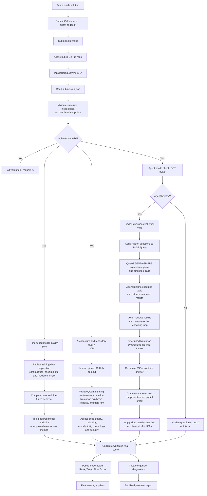

# Team Submission

Use this folder as the root of your team's fully public GitHub repository. Private repositories and
collaborator-only access are not supported. Replace the example values, add your source code and
training evidence, then submit the final repository URL and commit SHA.

```text
TeamSubmission/
  README.md
  submission.json
  src/
    .gitkeep
  training/
    .gitkeep
  logs/
    .gitkeep
  Participant_Package/
    answer_template.json
    Challenge_Brief.md
    public_questions.jsonl
    questions_template.json
    Setup_Instructions.md
    submission-guide.md
    submission_template.json
    validate.json
    handout/
      01_training_guide.md
      02_execution_guide.md
      03_scoring_and_examples.md
```

| Path | Required | Purpose |
|---|---:|---|
| `submission.json` | Yes | Team identity, pinned GitHub commit, agent endpoint, and fine-tuned model assessment information. |
| `src/` | Yes | Agent source code and any retrieval/data-query tools. |
| `training/` | Yes | Fine-tuning scripts, configs, preparation notes, logs, metrics, or model summary. |
| `logs/` | Yes | Non-sensitive run logs or screenshots useful for judging/debugging. |
| `Participant_Package/` | Yes | Challenge materials, examples, validation schema, and participant handouts. |

Files ending in `_template.json` are examples only. Edit the root `submission.json` for the final
team registration; use the question and answer templates to implement and test the `/query` API.

Use `src/` for the agent implementation submitted by your team. It must expose the required API
contract and implement the documented Qwen, tool-runtime, retrieval, and fine-tuned Nemotron flow.
Remove `.gitkeep` after adding source files.

Do not require `docs/`, `tests/`, `requirements.txt`, or Docker. The official Atom/shared
environment supplies common dependencies, and official scoring calls the registered agent endpoint.

## Agent Contract

The evaluation harness calls the endpoint declared in `submission.json`.

### Health Check

```http
GET /health
```

Must return HTTP 200. If this fails, the team is skipped.

Example:

```json
{"status": "ok"}
```

### Question Endpoint

```http
POST /query
Content-Type: application/json

{"question": "Hidden benchmark question"}
```

The returned JSON must include `answer`. The automated hidden-question judge grades only `answer`.
`steps` and `tool_trace` are optional and are retained only for private organizer diagnostics and
the submitting team's sanitized report. They do not appear on the public leaderboard.

The hidden-question harness may send up to **three concurrent `POST /query` requests per team**.
Your agent and model-serving stack must handle at least three simultaneous requests without mixing
responses or corrupting shared state. Organizers may lower this with `--workers`, but teams should
design for the documented default of three.

```json
{
  "answer": "41 of the 175 decision records changed the rate: 20 increases and 21 decreases.",
  "steps": 3,
  "tool_trace": [
    {
      "tool": "query_data",
      "args": {"dataset": "rba", "metric": "count_changes"},
      "result": "41 changes: 20 increases, 21 decreases"
    }
  ]
}
```

## Official Scoring

The final hackathon score combines three independently assessed categories:

| Category | Weight | Summary |
|---|---:|---|
| Fine-tuned model quality | 30% | Training quality, base-versus-fine-tuned improvement, robustness, evidence, and use of the fine-tuned model in the submitted solution. |
| Architecture and repository quality | 30% | Agent design, tools and retrieval, code quality, API compliance, reproducibility, documentation, training artifacts, logs, and repository hygiene. |
| Hidden-question evaluation | 40% | Component-based correctness on unseen questions, including partial credit and response-time penalties. |

```text
final_score =
    (fine_tuned_model_score * 0.30)
  + (architecture_repository_score * 0.30)
  + (hidden_question_score * 0.40)
```

See the [Challenge Brief](Participant_Package/Challenge_Brief.md#scoring) for the complete rubric.

## Hidden-Question Timeout And Slow Penalty

| Response time | Effect |
|---:|---|
| `<= 60s` | Full earned points |
| `> 60s` and `<= 300s` | 20% penalty on earned points for that question |
| `> 300s` | Timeout, zero points |

Example: if an answer earns `8/10` but returns in `83s`, the slow penalty is `1.6`, so the final
score is `6.4/10`.

## Leaderboard

The public leaderboard shows only **Rank**, **Team**, and the weighted final **Score**.
Latency, availability, tool usage, and step counts do not appear on the public leaderboard and are
not shared between teams.

After the run, each team receives a private detailed report covering only their own agent —
overall metrics plus a per-question breakdown with component YES/NO verdicts. Hidden grading
facts are stripped so nothing leaks from the question pool.

If your `GET /health` check fails at the start of the run, the team is skipped entirely and no
questions are graded. Test your endpoint from a different machine before submitting.

## Fine-Tuned Model Assessment

Fine-tuned model quality contributes 30% of the official score. Provide the model name and a
reachable OpenAI-compatible endpoint in `submission.json` when the organizers will test the model
directly. If direct model serving is not possible, agree on another assessment method with the
organizers before the deadline. The repository must still include training evidence and a
base-versus-fine-tuned comparison.

Typical setup:

```text
LiteLLM :4000
agent   :5000
vLLM FT :8001
```

Recommended architecture:

```text
brain/agent node -> Qwen3.6-35B-A3B-FP8 agent-brain + agent runtime
fine-tuning/model node -> fine-tuned Nemotron served by vLLM
```

Each team receives a two-node GIGABYTE Atom cluster with one NVIDIA GB10 per node. Hostnames and IP
addresses are assigned for the event, so use the values provided with your cluster rather than
hard-coding example machine names.

Required responsibility split:

1. Qwen3.6-35B-A3B-FP8, accessed through the supplied LiteLLM `agent-brain` alias, plans the answer and emits all
   tool calls and arguments.
2. The agent runtime validates and executes those calls against the approved datasets, then returns
   structured results to Qwen for any further reasoning.
3. When the tool loop is complete, the fine-tuned Nemotron model receives the question and verified
   tool results and synthesizes the final `answer`.

Participants fine-tune Nemotron, not Qwen3.6-35B-A3B-FP8. Qwen3.6-35B-A3B-FP8 requests tool calls; the application code performs
the actual dataset operations. See [Challenge Brief → Required Model
Roles](Participant_Package/Challenge_Brief.md#required-model-roles) for the binding model roles.

The cluster bootstrap starts with `DOMAIN_PREDICT_MODE=mock` so the pre-training scaffold can run.
After serving the adapter, set `DOMAIN_PREDICT_MODE=llm` before evaluation. Keeping `mock` enabled
means the submitted agent is not using the fine-tuned model and will lose model-quality and
architecture credit.

`submission.json` serves all three assessment pillars: the hidden-question harness uses the agent
endpoint, paths, and declared timeout; organizers use the public repository and pinned commit for
architecture review; and the declared model name and endpoint (or an approved alternative) support
fine-tuned-model assessment. The hidden-question harness does not clone or grade the repository.
Organizers can copy individual files into `p3_eval/submissions/<team>/submission.json` or pass the
portal's exported `submissions.json` manifest to the harness.

## Evaluation Flowchart



## Participant Checklist

- Publish the contents of `TeamSubmission/` as the root of your fully public GitHub repo; private
  repositories and collaborator-only access are not supported.
- Fill in `submission.json` with final team info, IP, ports, and commit SHA.
- Keep `agent.endpoint` reachable from the organizer machine; do not use `localhost`.
- Confirm `GET /health` returns HTTP 200.
- Confirm `POST /query` accepts `{"question": "..."}`.
- Confirm `/query` returns JSON with `answer`.
- Put source code in `src/`.
- Put fine-tuning/training evidence, configuration, metrics, and a model summary in `training/`.
- Include a documented comparison between the supplied base model and the fine-tuned model.
- Make the fine-tuned model available for assessment through its declared endpoint or an organizer-approved method.
- Use the supplied Qwen3.6-35B-A3B-FP8 `agent-brain` alias for planning, tool selection, and tool-call generation.
- Execute Qwen's requested tool calls in the agent runtime and return structured results to the reasoning loop.
- Set `DOMAIN_PREDICT_MODE=llm` after the fine-tuned adapter is live; do not submit with the bootstrap `mock` mode.
- Use the fine-tuned Nemotron model to synthesize the final answer from the verified tool results.
- Confirm the service remains correct with three simultaneous `POST /query` requests.
- Document the complete Qwen, runtime, tool, retrieval, and Nemotron data flow in `README.md`.
- Put non-sensitive logs in `logs/`.
- Do not commit credentials, API keys, or hidden evaluation data.
